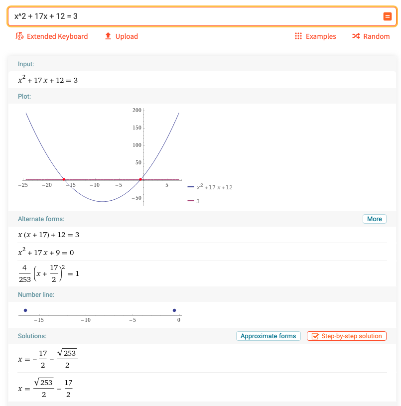

# Refresher and Functions

[<= Back to the Cheatsheet](../WolframCheatsheet.md)

**IMPORTANT** You will need to have a [WolframAlpha Pro account](https://www.imperial.ac.uk/admin-services/ict/self-service/computers-printing/devices-and-software/get-software/get-software-for-students/wolfram-alpha-pro/) to use Wolfram effectively.

## Basic Algebra
WolframAlpha is a really powerful tool for algebra. Most of the learning you do won't be through these sheets (because there is too much to teach), but through playing around with it and seeing what happens.

Wolfram is incredibly powerful: you can ask it anything. You can speak to it in English, and it will reply with maths. Try asking Wolfram to [split a fraction into partial fractions](https://www.wolframalpha.com/input/?i=%285x-4%29%2F%28x%5E2-x-2%29+partial+fraction). It really is as simple as writing ```(your-fraction) partial fraction``` into the search bar.

If you want it to solve a quadratic, you don't even need to ask the question: just type any equation, e.g. ```x^2 + 17x + 12 = 3``` and it'll work out what you want. It will even graph the equation (useful for curve sketching).



Let's give it a [simple quadratic](https://www.wolframalpha.com/input/?i=y%3D5x%5E2-3x-2). If you feed Alpha a function, it will return a wealth of information about it. Play around with this example by adjusting the coefficients, just so you’re confident that you understand how its working. Notice that it’s picking a sensible scale for the plot to ensure that features are visible. 

Even if you decide to write the function in an [unconventional way](https://www.wolframalpha.com/input/?i=%28-5%28-%28g%29%5E%282%29%29-+3+g+++++-++++%5B%2B2%5E1+g%5E0%5D%29), Alpha will usually workout what you meant!

You can also give it [specific requests](https://www.wolframalpha.com/input/?i=roots+of+y%3D5x%5E2-3x-2). 

## Functions
Wolfram has it's [own documentation](https://www.wolframalpha.com/examples/mathematics/mathematical-functions/).

### Plotting
Literally just type ```plot```. [Here](https://www.wolframalpha.com/input/?i=plot+y%3De%5E-x+and+y%3Dcos%28pi+x%29+and+y%3Dcos%28pi+x%29+e%5E-x+for+0%3Cx%3C5) we are plotting two functions and their product, all on the same axes. It is often really useful to see this.

### Rational Functions & Limits
We can plot composite functions, made up of one function / another function. [Here](https://www.wolframalpha.com/input/?i=y%3D%28x%5E2-3x%2B2%29+and+y%3D%282x-5%29+and+y%3D%28x%5E2-3x%2B2%29%2F%282x-5%29+for+0%3Cx%3C4+and+-3%3Cy%3C3) we plot two functions as well as one / the other, and impose limits on the plot.

Note that the roots of the numerator are still roots of the function and roots of the denominator result in an asymptote of the ratio. We can ask Wolfram to [plot these asymptotes](https://www.wolframalpha.com/input/?i=asymptotes+y%3D%28x%5E2-3x%2B2%29%2F%282x-5%29), too.

We can use these techniques to visualize functions: plotting them is an extremely useful tool.

### Parameterisation 
You can even leave all of the values in a function as an unknown constant and [explore the resulting multidimensional space](https://www.wolframalpha.com/input/?i=plot+y%3Dsin%28ax%29) or [test a set of values](https://www.wolframalpha.com/input/?i=plot+y%3D5x%5E2-3ax-a+where+a%3D%281%2C2%2C3%2C4%29).

### Different coordinate systems
You can visualize functions in [cartesian](https://www.wolframalpha.com/input/?i=plot+y%3D2%5Ex+%2B2+and+y%3D2%5E%28x%2B2%29+for+-3%3Cx%3C3) and [semi-log axes](https://www.wolframalpha.com/input/?i=log+plot+y%3D2%5Ex+%2B2+and+y%3D2%5E%28x%2B2%29+for+-3%3Cx%3C3). 

## Side note on Desmos
Desmos is an excellent graphing calculator alternative to Wolfram (for graphical things). [Here](https://www.desmos.com/calculator/i2vscwbc1o) is an example Desmos graph - you can see how this could be extremely useful, especially for curve identification. Using the sliders on the left-hand side, you can change the parameters, and thus the shape, of the function.