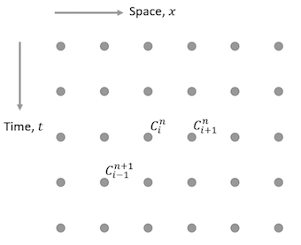
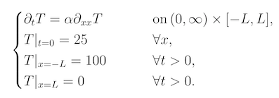
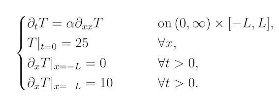
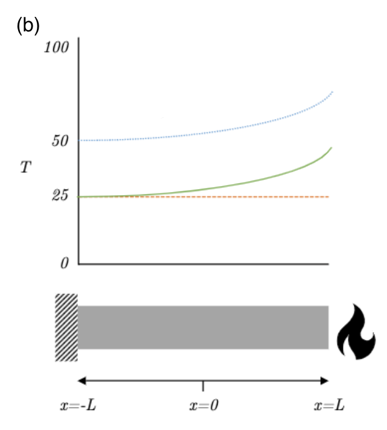

<link rel="stylesheet" type="text/css" media="all" href="styles.css">

# Finite Methods Tutorial Sheet, #13

    

# Problem sheet
## Essential Questions
### Problem 1.
Let $f(x)=x^2$. Find the first order forward finite difference approximation to $f'(3)$ using step size $h=0.1$

 
The general first order finite difference approximation formula can be achieved by:
\begin{equation*}
f(x_0+h) = f(x_0)+hf'{(x_0)}+o(h^2)
\end{equation*}

Rearranging gives

\begin{equation*}
f'(x_0)=\frac{f(x_0+h)-f(x_0)}{h}+\frac{o(h^2)}{h}
\end{equation*}
\begin{equation*}
=\frac{f(x_0+h)-f(x_0)}{h}+o(h)
\end{equation*}

Ignoring the $o(h)$ term, the first order FD approximation to $f_x(x_0)$ can be achieved as  below:

\begin{equation*}
f'(x_0)\approx\frac{f(x_0+h)-f(x_0)}{h}
\end{equation*}
\newline
Substituting for $f(x)$ gives,
\begin{equation*}
f'(x_0)\approx\frac{(x_0+h)^2-x_{0}^2}{h}
\end{equation*}

Substituting in $x_0 = 3$ and $h = 0.1$ gives,

\begin{equation*}
f'(3)\approx\frac{(3+0.1)^2-3^2}{0.1}=6.1
\end{equation*}

The exact answer from basic calculus is clearly $f_x(3)=6$ so the error in the approximation is $6.1-6=0.1$. Repeating the problem with $h = 0.05$ (i.e. half the step size) gives,

\begin{equation*}
f'(3)\approx\frac{(3+0.05)^2-3^2}{0.05}=6.05
\end{equation*}

The error is $6.05-6=0.05$, halving step size results in a halving of error. So, as expected, the error is proportional to $h$. 

        

-----------------------------------

## Challenging Questions
### Problem 2.
Suppose we want a one-sided approximation to $u'(x)$ based on $u(x)$,$u(x-h)$ and $u(x-2h)$,of the form:
$$
    u'(x)\approx au(x)+bu(x-h)+cu(x-2h)
$$
Determine the coefficients $a$, $b$, and $c$ to give the best possible accuracy by expanding in taylor series and collecting terms.

The expansion of the function values of $u(x)$ in a Taylor series about the point $x$ can be presented as below,

\begin{equation*}
u(x-h) = u(x)-h u'(x)+\frac{1}{2}h^2u''(x)-\frac{1}{6}h^3u'''(x)+o(h^4)
\end{equation*}

Similarly,  $u(x-2h)$ can be expanded as below

\begin{equation}
u(x-2h)=u(x)-(2h) u'(x)+\frac{1}{2}(2h)^2u''(x)-\frac{1}{6}(2h)^3u'''(x)+o((2h)^4)
\end{equation}

Inserting $(1)$ and $(2)$ in the initial approximate equation for $u'(x)$, gives

\begin{equation*}
u'(x)\approx (a+b+c)u(x)-(b+2c)h u'(x)+\frac{1}{2}(b+4c)h^2u''(x)
\end{equation*}	
\begin{equation*}
-\frac{1}{6}(b+8c)h^3u'''(x) +...
\end{equation*}	

If this is going to agree with $u'(x)$ to high order then we need the first and third terms to disappear (i.e. set their coefficients to zero).  

\begin{equation*}
\begin{cases}
    &a+b+c=0\newline
    &b+2c=-\frac{1}{h}	\newline
    &b+4c=0
\end{cases}
\end{equation*}	

We might like to require that higher order coefficients be zero as well, but since there are only three
unknowns $a$, $b$ and $c$, we cannot in general hope to satisfy more than three such conditions. Solving
the linear system  gives

\begin{equation*}
a=\frac{3}{2h}, \quad b=-\frac{2}{h}, \quad c=\frac{1}{2h}
\end{equation*}	

So the formula is

\begin{equation*}
u'(x)\approx\frac{1}{2h}[ 3u(x)-4u(x-h)+u(x-2h) ]
\end{equation*}	

The error in this approximation is,

\begin{equation*}
error=\frac{1}{12}h^2u'''(x)+...
\end{equation*}

Notice that this one-sided approximation is $o(h^2)$ accurate, whereas the usual backwards difference is $o(h)$, so this approach (using an additional data point) will improve the accuracy of the approximation.

        

-----------------------------------

### Problem 3.
(a) Find the update equation, $x(t + \Delta t)$, of the following ODE,
$$ \frac{d^2x(t)}{dt^2} + \omega^2 x(t)=0 $$
(Hint: Use the central difference approximation to the second derivative).

Using the finite difference approximation to the second derivative,}

\begin{align*}
\frac{d ^2x(t)}{d t^2}
\approx
\frac{x(t-\Delta t) - 2x(t) + x(t+\Delta t)}{\Delta t^2}
\end{align*}

the ODE can be re-written as,

\begin{align*}
\frac{x(t-\Delta t) - 2x(t) + x(t+\Delta t)}{\Delta t^2} + \omega^2 x(t) = 0
\end{align*}

Re-arrange for $x(t+\Delta t)$,

\begin{align*}
x(t+\Delta t) = (2 - \omega^2 \Delta t^2) x(t) - x(t-\Delta t)
\end{align*}

        

Now given initial conditions of
$x(0)=1$ and $\dot{x}(0)=0$:

(b) Approximate $\dot{x}(0)$ with a backward difference.

Write a table of values for $x(t)$ every $\Delta t$ time step up to $t = 2\Delta t$,
using the dimensionless parameter, $\sigma = \omega^2 \Delta t^2 = 0.1$

We need to calculate $x(\Delta t)$, which depends on $x(0)$ and $x(-\Delta t)$.
We know $x(0) = 1$ from the initial condition.
We can use the second initial condition, $\dot{x}=0$ to calculate $x(-\Delta t)$,
since,
\begin{align*}
    \dot{x}(0) \approx \frac{x(0) - x(-\Delta t)}{\Delta t} \\
    \Rightarrow
    x(-\Delta t) = x(0) = 1
\end{align*}
We can then plug these values into the update equation to find,
\begin{align*}
    x(\Delta t) &= (2 - \sigma) x(0) - x(-\Delta t) \\
    &= (2 - 0.1) 1 - 1 \\
    &= 0.9
\end{align*}
Similarly for $x(2 \Delta t)$, which depends on $x(\Delta t)$ and $x(0)$,

  

\begin{align*}
& t / \Delta  t &   & x(t) & \newline
\hline
& -1 &    & 1 & \newline
& 0 &    & 1 & \newline
& 1 &    & 0.9 & \newline
& 2 &    & 0.71 & \newline
\hline
\end{align*}

        

(c) Approximate $\dot{x}(0)$ with a central difference.

Write a table of values for $x(t)$ every $\Delta t$ time step up to $t = 2\Delta t$,
using the dimensionless parameter, $\sigma = \omega^2 \Delta t^2 = 0.1$

For a central difference method, finding $x(-\Delta t)$ is a little more involved.
The approximation to the first derivative at $t=0$ is,

\begin{equation*}
    \dot{x}(0) = 0 = \frac{x(\Delta t) - x(-\Delta t)}{2 \Delta t}
\end{equation*}

therefore, $x(-\Delta t)$ = $x(\Delta t)$.
Inserting this into the update equation at $t=0$,

\begin{align*}
x(\Delta t) = (2 - \sigma) x(0) - x(-\Delta t)
\end{align*}

And using our previous identity, we can rearrange,

\begin{align*}
x(-\Delta t) = x(\Delta t) = \frac{2 - \sigma}{2} x(0)
\end{align*}

Or with all initial conditions,
$x(-\Delta t) = x(\Delta t) = 0.95$.
From here we can use the update equation to iterate,

\begin{align*}
& t / \Delta  t &   & x(t) & \newline
\hline
& -1 &    & 0.95 & \newline
& 0 &    & 1 & \newline
& 1 &    & 0.95 & \newline
& 2 &    & 0.81 & \newline
\hline
\end{align*}

        

(d) Use Excel or otherwise to simulate both for $t/\Delta t$ up to 30, what do you see?

[Example sheet](https://docs.google.com/spreadsheets/d/1xl-y2ZNephq5xFhGiN_elvjIguKhOt5i5e09kftDhI8/edit?usp=sharing)

        

## Exam Style Questions
### Problem 4.
The following image shows a regularly spaced grid of nodes representing the distribution of the scalar parameter $\{C}$ in time, $\{t}$, and one-dimensional space, $\{x}$.

(a) Write down an expression for the central-difference approximation to the time derivative $\frac{\partial C}{\partial t}$ at the point $\{C^{n+1}_i}$.

$\boxed{\frac{\partial C}{\partial t}|_{i, n+1} \approx \frac {(C^{n+2}_i - C^{n}_i)}{2 \Delta t}} $
 
Note: The central difference approximation for the time derivative considers the time one step before, ($C^n_i$) and after, ($C^{n+2}_i$) the point of interest (${C^{n+1}_i}$), and is independent of the spacial parameter ${x}$.

        

(b) Explain whether the central difference approximation is more / less accurate than the forward-difference approximation.

Central difference is the average of forward-difference and backward-difference.
 
FD: $f'(x) = (\frac{f(x + \Delta x) - f(x)}{\Delta x}) - \frac{f''(x)}{2}\Delta x - \frac{f^{(3)}(x)}{6}\Delta x^2 - ... $
 
BD: $f'(x) = (\frac{f(x - \Delta x) - f(x)}{\Delta x}) + \frac{f''(x)}{2}\Delta x - \frac{f^{(3)}(x)}{6}\Delta x^2 + ... $
 
Therefore, CD: $f'(x) = (\frac{f(x + \Delta x) - f(x - \Delta x)}{2\Delta x}) - O(\Delta x^2)... $
 
Hence, CD is more accurate as it's $O(\Delta x^2)$ instead of $O(\Delta x)$.

        

(c) Why does it become impractical to continually reduce the step-size $\{\Delta x}$ in order to improve the accuracy of the simulation?

- Computational expense performing calculations
 
- Memory required to store values
 
- Finite precision of values may not be able to resolve small differences.

        

### Problem 5.

A metal bar is heated and its temperature is described by the following system of equations.

(a) Sketch the Temperature-Position graph corresponding to the bar using the following system of equations at:

(i) Initial temperature (t = 0)\
(ii) At t > 0\
(iii) Steady state conditions (as t tends to infinity)

 
(i) Red line
 
(ii) Green line
 
(iii) Blue line
 
 
(i) At $t = 0$, the temperature is 25 degrees for all values of $x$, therefore this is displayed as a horizontal line (red).
 
(ii) At $t>0$ the graph will be curved (which will eventually tend towards a straight line). Ensure that the temperature is 0 and 100 at the ends of the bar (green).
 
(iii) The temperature will always be constant at both ends (100 degrees at one end, and 0 degrees at the other). Therefore as t tends towards infinity, this will become a diagonal line from 100 degrees to 0 degrees (blue).
 
 
Matlab Animation:
 

        

(b) Sketch the Temperature-Position graph corresponding to the bar using the following system of equations at:

(i) Initial temperature (t = 0)\
(ii) At t = a (where a is some arbitrary value)\
(iii) At t = b (where b is some arbitrary value and b > a)

 
(i) Red line
 
(ii) Green line
 
(iii) Blue line
 
 
(i) At $t = 0$, the temperature is 25 degrees for all values of $x$, therefore this is displayed as a horizontal line (red).
 
(ii) At $t>0$ e.g. $t=a$, the bar has a constant temperature gradient at both ends (0 at (-) end which we can think of as an insulating barrier- letting no heat in or out, and 10 at (+) end we can think of this as a controlled heat source, like a laser). Therefore the shape of the graph follows a curved shape. (green)
 
(iii) At $t=b$: Since this system is gaining heat at one end and not losing any heat at the other, it will  keep getting hotter and hotter (shifted higher up graph), although the shape of the temperature profile will stay the same for $t≥a$. (blue)
 
 
Matlab Animation

        

-----------------------------------
## Answers

<button type="button" onclick="displayAnswerButtons('block')">Show answer buttons</button>
<button type="button" onclick="displayAnswers('block')">Show all answers</button>
<button type="button" onclick="displayAnswers('none')">Hide all answers</button>
  
### For Printing
<button type="button" onclick="prepareForPrint('block')">Add whitespace</button>
<button type="button" onclick="prepareForPrint('none')">Remove whitespace</button>

  

# Next week, Root Finding!